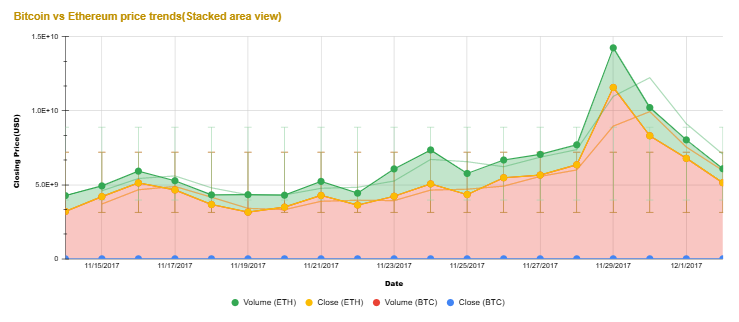

# 💰 Cryptocurrency Price Analysis

A short, hands-on data analysis project exploring *real cryptocurrency market trends* — built using Excel / Google Sheets.

## 🧠 Overview
- *Dataset:* Kaggle – Cryptocurrency Prices  
- *Tools:* Google Sheets & Excel  
- *Focus:* Price movement of BTC, ETH, USDT, and BNB  

## 📈 Visualization

(Stacked area chart comparing daily closing prices and volumes.)

## 🔍 Key Insights
- 🪙 *Bitcoin* shows highest volatility  
- 💹 *Ethereum* trends closely with BTC  
- 💵 *USDT* remains stable — as expected  
- 📊 *BNB* shows steady long-term growth  

## 🧰 Skills Used
Data Cleaning • Data Visualization • Analytical Thinking • Spreadsheet Analysis • Python code configuration and interpretation 
